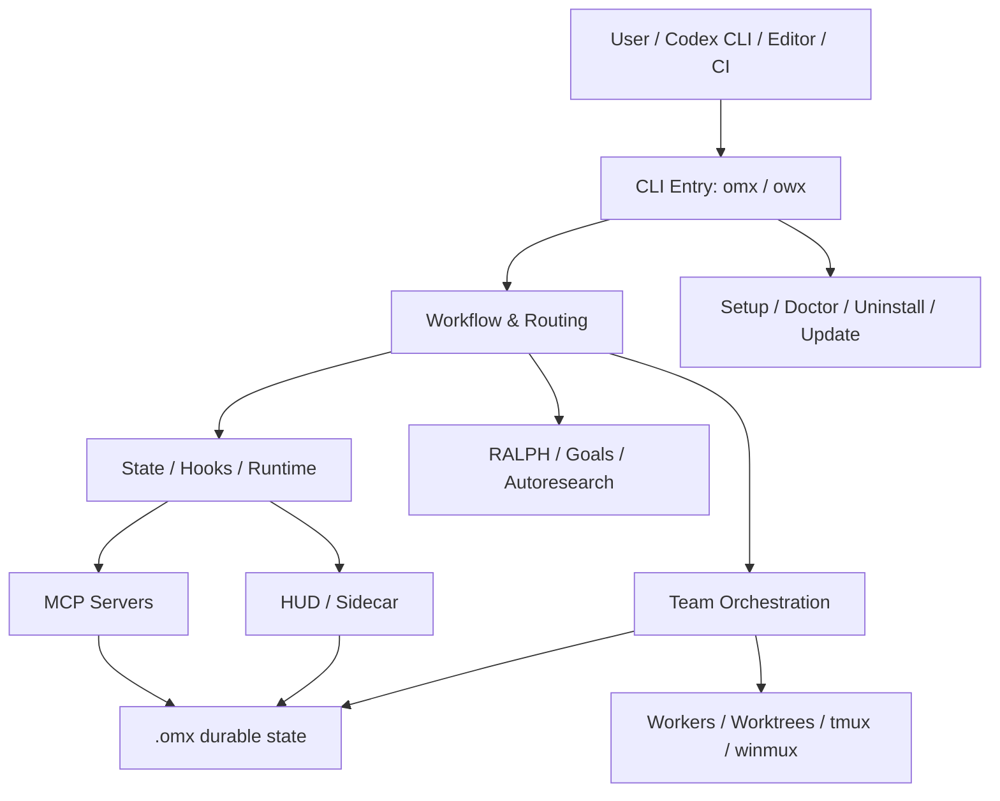

# oh-my-codex 项目架构说明

本文档描述本仓库的总体架构、核心模块边界、运行时数据流和交付形态，目标是让新维护者能快速理解：**入口在哪里、能力分布在哪里、状态存哪里、如何验证**。

## 1. 项目定位

oh-my-codex（OMX）是 OpenAI Codex CLI 的多代理工作流层。它不替代 Codex，而是在其外层提供：

- 更稳定的启动与运行时管理
- 统一的工作流路由（如 `$deep-interview` / `$ralplan` / `$team` / `$ralph`）
- 可持久化的状态、计划、日志和记忆
- CLI、MCP、hook、HUD、team runtime 的协同能力

## 2. 总体分层

### 分层说明

1. **入口层**：`src/cli/*`、`src/index.ts`、`src/cli/owx.ts`
2. **领域层**：`src/team`、`src/state`、`src/hooks`、`src/ralph`、`src/autoresearch`、`src/mcp`
3. **运行时层**：`src/runtime`、`src/hud`、`src/sidecar`、`src/winmux`
4. **配置与交付层**：`src/config`、`src/agents`、`src/catalog`、`src/scripts`
5. **资源层**：`skills/`、`prompts/`、`templates/`、`plugins/`

## 3. 入口与命令面

### 3.1 包入口

- `src/index.ts`：包级导出，主要暴露 `setup`、`doctor`、`version`、`mergeConfig`、agent 定义、HUD 命令等
- `dist/cli/omx.js` / `dist/cli/owx.js`：npm bin 输出
- `src/cli/index.ts`：主 CLI 分发器
- `src/cli/owx.ts`：Windows 友好入口，兼容 winmux 管理

### 3.2 命令职责

`owx` 负责把用户意图分发到具体子系统：

- `setup` / `update` / `uninstall` / `doctor`：安装与健康检查
- `team` / `ralph` / `ultragoal` / `performance-goal`：工作流执行与持久化目标
- `state` / `wiki` / `trace` / `notepad` / `project-memory`：持久化数据面
- `mcp-serve`：MCP 服务入口
- `hud` / `sidecar`：可视化运行态
- `hooks` / `tmux-hook`：运行时事件与集成
- `explore` / `sparkshell`：只读探索与辅助执行

## 4. 核心领域模块

### 4.1 工作流与调度

目录：`src/team`, `src/state`, `src/ralph`, `src/ralplan`, `src/autoresearch`

职责：

- 团队编排、worker 分配、worktree 管理
- 状态机与流程转换
- RALPH 持久化与完成审计
- autoresearch 研究任务与目标门控

关键数据：

- `.omx/state/*.json`
- `.omx/worktrees/*`
- `.omx/goals/*`

### 4.2 Hook 与 prompt 路由

目录：`src/hooks`, `src/scripts/notify-hook*`, `src/scripts/codex-native-hook.ts`

职责：

- 解析 prompt keyword
- 做工作流切换与上下文注入
- 驱动通知、stop/turn complete、tmux 相关回调
- 保持 native hook 与兼容路径一致

### 4.3 状态与持久化

目录：`src/state`, `src/mcp/state-server.ts`, `src/mcp/memory-server.ts`, `src/mcp/trace-server.ts`

职责：

- 读写 `.omx/state`
- 提供 CLI parity 与 MCP parity
- 支持会话级与根级状态优先级
- 维护 notepad/project-memory/wiki/trace 等持久化面

### 4.4 运行时与 UI

目录：`src/runtime`, `src/hud`, `src/sidecar`, `src/winmux`

职责：

- 交互式运行生命周期
- tmux / detached session / Windows mux 兼容
- HUD 状态展示
- 只读 sidecar 可视化

### 4.5 资源与交付

目录：`src/agents`, `src/catalog`, `skills/`, `prompts/`, `templates/`, `plugins/`

职责：

- 生成 native agent 配置
- 管理技能/提示词目录
- 维护插件镜像与 catalog
- 支持发布、安装和镜像同步

## 5. 运行数据流

### 5.1 启动流

1. 用户执行 `owx` 或 `omx`
2. CLI 判断命令/启动策略
3. 进入 Codex 主进程或 tmux / winmux 管理层
4. 初始化 hooks、state、HUD、MCP、team runtime
5. 写入会话与运行时状态

### 5.2 工作流路由流

1. 解析用户输入中的关键词或命令
2. 判断是否需要澄清、规划、执行或验证
3. 更新 `.omx/state`
4. 通过 hooks / MCP / team runtime 触发后续动作
5. 记录审计与完成结果

### 5.3 Team 执行流

1. `team` 解析任务并拆分
2. `worktree` 规划隔离工作区
3. 为 worker 分配角色与模型
4. 通过 tmux / winmux 启动并监控 worker
5. 汇总结果并写回状态和日志

## 6. 代码组织

### 6.1 `src/` 主要目录

| 目录 | 作用 |
| --- | --- |
| `cli/` | 命令行分发、子命令实现、安装/诊断/运行入口 |
| `team/` | 多 worker 编排、worktree、分配策略、运行状态 |
| `hooks/` | prompt 路由、事件派发、native hook 兼容 |
| `state/` | 统一状态模型与转换逻辑 |
| `mcp/` | MCP 服务与兼容服务器 |
| `hud/` | 终端状态展示 |
| `runtime/` | 进程与终端生命周期管理 |
| `config/` | 配置生成、hook 注入、模型与 MCP 目录 |
| `agents/` | native agent 定义与 TOML 生成 |
| `catalog/` | 技能/插件目录与 schema |
| `autoresearch/` | 研究型 goal runtime |
| `ralph/` | RALPH 持久化与完成审计 |
| `wiki/` | 轻量文档知识库 |
| `winmux/` | Windows mux 兼容层 |

### 6.2 构建目标

- TypeScript 编译到 `dist/`
- Rust/cargo 产物用于部分探索与辅助工具
- 发布包包含 `skills/`、`prompts/`、`templates/`、`plugins/` 和必要的元数据

## 7. 数据与配置边界

### 7.1 仓库内持久化目录

- `.omx/`：运行态、计划、日志、目标、工作树、记忆
- `.codex/`：Codex 配置与 hook 相关集成
- `.agents/`：Agent marketplace 与插件元数据

### 7.2 运行期权威性

- **CLI/JSON** 是主控制面
- **MCP** 是兼容与集成面，不是唯一权威
- **hook** 负责把事件转成可追踪的状态变更
- **HUD / sidecar** 只负责展示与辅助，不应成为唯一事实源

## 8. 架构约束

- 尽量保持 CLI parity，尤其是状态、团队和记忆面
- 状态写入要可追踪、可恢复、可审计
- 允许兼容层存在，但不要让兼容层反客为主
- 工作流切换必须有测试覆盖
- 平台差异（尤其 Windows / tmux）应封装在运行时边界内

## 9. 推荐阅读顺序

如果要继续深入，建议按这个顺序看：

1. `README.md`
2. `docs/STATE_MODEL.md`
3. `docs/architecture/cli-first-mcp-taxonomy.md`
4. `src/cli/index.ts`
5. `src/team/orchestrator.ts`
6. `src/state/workflow-transition.ts`
7. `src/hooks/keyword-detector.ts`
8. `src/mcp/state-server.ts`

